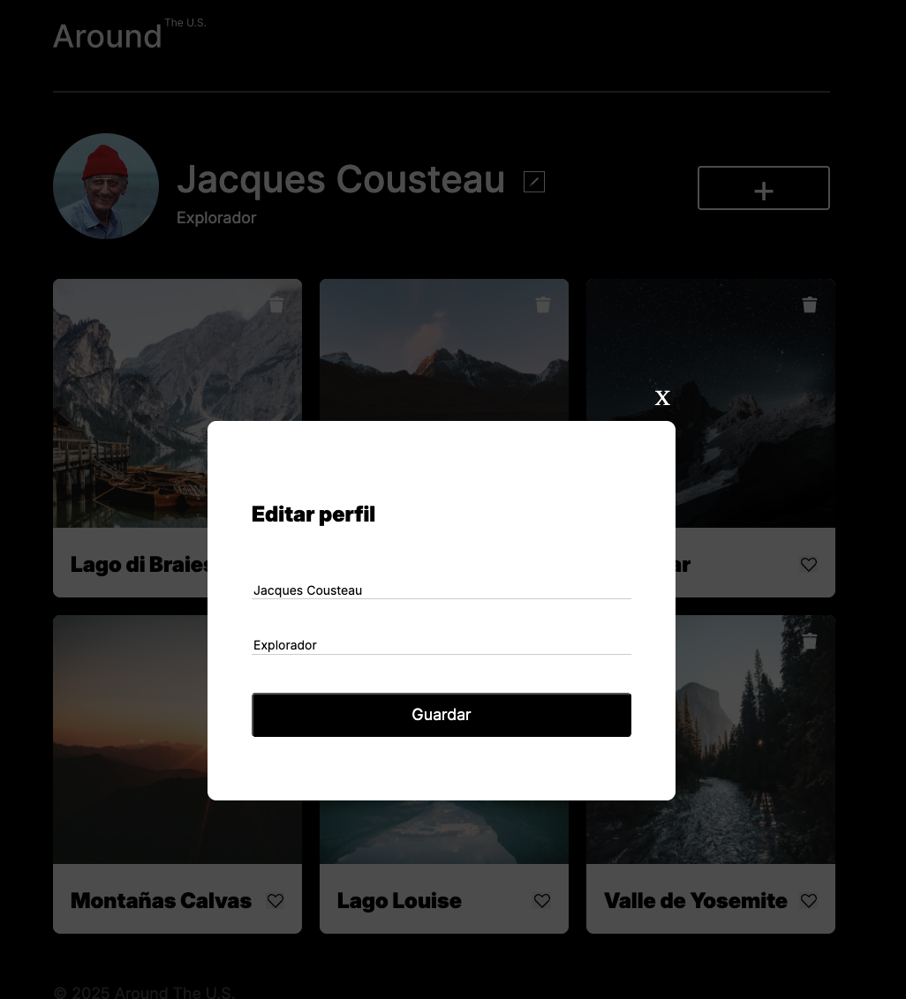
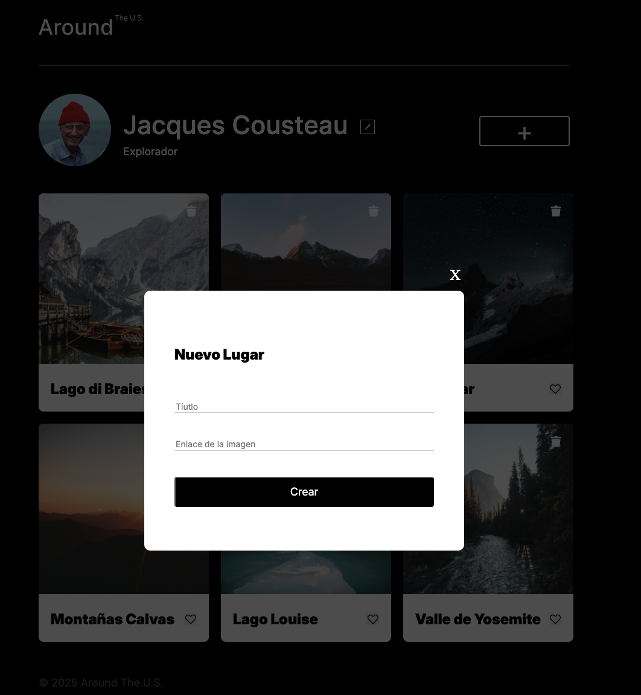
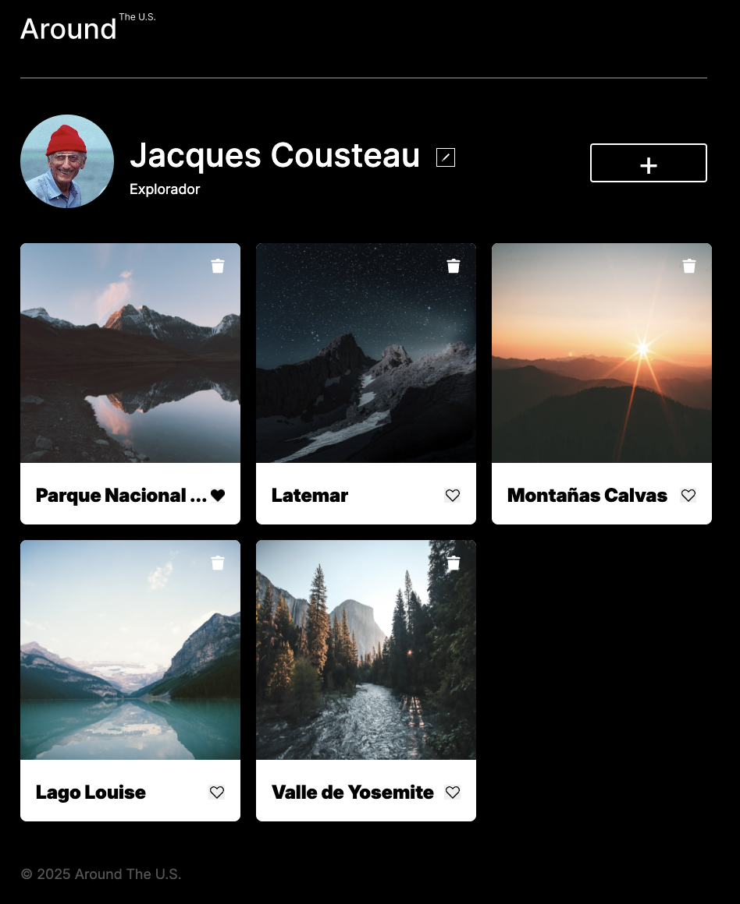

# Tripleten web_project_around

# Proyecto: Alrededor de los Estados Unidos

Este es un proyecto web del curso de desarrollo web, donde se construye una página responsiva utilizando HTML, CSS y JavaScript. En este sitio se presenta una galería de fotos de distintos lugares en Estados Unidos, permitiendo al usuario interactuar con ellas.

## ✨ Características principales

- Diseño responsivo para dispositivos móviles y de escritorio.
- Uso de metodologías como BEM para la estructura del CSS.
- Estructura modular de archivos.
- Interactividad con JavaScript: likes, popups y formularios.

## 🚀 Tecnologías utilizadas

- HTML
- CSS
- JavaScript
- Git & GitHub

## Imágenes de características del proyecto

## 🔗 Enlace al proyecto publicado

[Ver el proyecto en GitHub Pages](https://lolinalc.github.io/web_project_around/)
